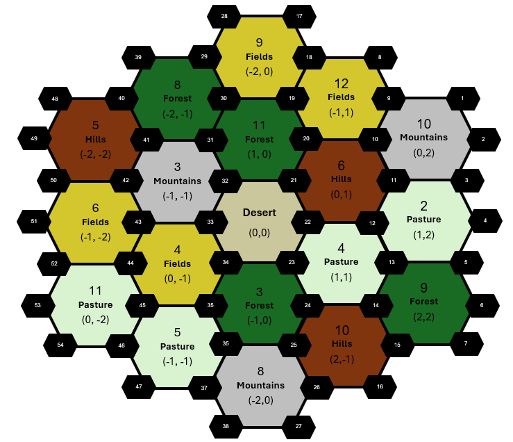
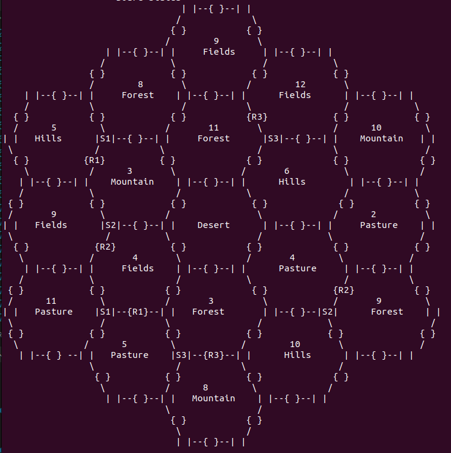

# Settlers of Catan

## Overview

This project is an interactive simplified version of the board game "Settlers of Catan". 

The game is designed for three players and features basic mechanics such as resources gathering, building structures (as roads, settlements and cities), and trading resources and cards among players. The goal in that game is to be the first player to reach 10 victory points.

## Game Rules

The game is played on a board consisting of 19 land tiles surrounded by the sea, producing resources necessary for building and advancement. Players gather resources based on their closeness to these tiles, which are forest (produces wood), hills (produces brick), pasture (produces wool), fields (produces grain), mountains (produces ore), and the desert (yields nothing).

### Gameplay Mechanics

- **Dice Rolling:** Determines resource distribution based on the tiles' assigned numbers (2-12).
- **Building:** Use resources to construct roads, settlements, and upgrade settlements to cities.
- **Trading:** Exchange resources and cards between players.
- **Development Cards:** Purchase cards that provide various benefits.
- **Victory Points:** Earned through certain development card. 

## The goal

The first player to reach 10 victory points wins the game.

## Class Hierarchy and Responsibilities

### Catan Class

- **Responsibility:** Manages the overall game state, including initializing the game board, handling turns, distributing resources, and determining the game winner.
- **Key Methods:**
  - `initializeGame()`: Sets up the initial state of the game.
  - `distributeResources()`: Allocates resources to a player based on the locations of their settlements.
  - `PlayGame()`: Executes the main game loop, controlling the flow of the game until a player wins.
  - `handleBuyDevelopmentCard()`, `handleDevelopmentCardUsage()`, `handleSevenRoll()`: Manage specific options during the game.

### Player Class

- **Responsibility:** Represents a player in the game. Manages the player's resources, settlements, roads, and development cards.
- **Key Methods:**
  - `canBuild()`: Determines if a player has the necessary resources to construct a road, settlement, or city.
  - `buildRoad()`: Constructs a road on a specified edge.
  - `buildSettlement()`: Places a new settlement at a designated intersection.
  - `upgradeToCity()`: Upgrades an existing settlement to a city, increasing resource production at that location.
  - `trade()`: Manages trading of resources or development cards between players.
   
### Board Class

- **Responsibility:** Represents the game board. Manages tiles, intersections, and edges where players can build.
- **Methods:**
  - `initializeAdjacency()`: Initializes the adjacency list for intersections, determining connectivity.
  - `placeInitialSettlement()`: Places an initial settlement at a specified intersection during the setup phase as of the beginner's game rule.
  - `placeInitialRoad()`: Places an initial road on a specified edge during the game setup.
  - `distributeResourcesBasedOnDiceRoll()`: Allocates resources to players based on the dice roll matching the numbers on the game tiles.
  - `canPlaceSettlement()` and `canPlaceRoad()`:  Determines if a settlement or road can legally be placed on the board by checking adjacency rules and connection to player's structures.
  - `placeSettlement()` and `placeRoad()`:  Places a settlement or road for a player on the board.
  - `upgradeSettlementToCity()`: Upgrades an existing settlement to a city.
- **Explanation:** Each tile on the board is uniquely identified by its coordinates, which are represented by vertices. The game board is a network of junctions, numbered from 1 to 54, known as intersections. Each intersection acts as a critical point where up to three tiles converge. To facilitate a clear and visually coherent representation of the board using ASCII characters, the original board layout has been rotated to the right. 

  

- Below is an example of how the game board is dynamically visualized during play:

  

## Card Class

The card management system is designed around an abstract base class, `DevelopmentCard`, from which all specific card types derive. The hierarchy is structured to encapsulate common functionalities and extend unique behaviors for different card types.

## ResourceType Class
- **Responsibility**: Defines the types of resources available in the game.
- **Resource Types**: *WOOD*, *BRICK*, *WOOL*, *GRAIN*, *ORE* and *NONE (DESERT)*. 

### DevelopmentCard (Abstract Class)

- **Responsibility:** Serves as the base class for all types of development cards. Defines the interface for card functionalities.
- **Methods:** `activateCard()`, `getType()`, `getCardQuantity()`, etc.

### Subclasses of DevelopmentCard

Each subclass represents a specific type of card available in the game, implementing unique functionalities and storing a static quantity to track available cards.

#### KnightCard

- **Responsibility:** Represents a Knight card, used primarily to qualify for the "Largest Army" award.
- **Mechanics:** A player needs to collect at least three Knight cards to initially qualify for the "Largest Army," which grants an additional 2 victory points. If another player accumulates more Knight cards than the current holder, the "Largest Army" award and its points are transferred to the player with the most Knight cards.
- **Key Method:** Currently, this method is designed but not activated within the game logic. It is reserved for future expansions where the Knight card might play a more dynamic role.

#### VictoryPointCard

- **Responsibility:** Grants an immediate victory point to the player upon acquisition.
- **Key Method:** `activateCard` (Activates the Victory Point card, awarding one victory point to the player).

#### PromotionCard (Abstract Class)

- **Responsibility:** Acts as a base for promotional cards offering various strategic advantages.
- **Key Method:** Inherits from `DevelopmentCard`.

##### MonopolyCard

- **Responsibility:** Allows a player to declare monopoly on a resource type, forcing all other players to give their resources of that type to the monopolizing player.
- **Key Method:** `activateCard()` (executes the monopoly effect).

##### RoadBuildingCard

- **Responsibility:** Permits a player to build two roads at no resource cost.
- **Key Method:** `activateCard()` (allows placement of two roads).

##### YearOfPlentyCard

- **Responsibility:** Gives a player two resources of their choice from the general supply.
- **Key Method:** `activateCard()` (allows the player to choose and receive two resources), `chooseResource()` (guides the player to select a resource).

## Board Components (Tile, Intersection, Edge and Vertex classes)

### Tile Class

- **Responsibility**: Represents a plot of land on the game board. Each tile is associated with a specific type of resource and a number.
- **Key Methods**:
  - `getResourceType()`: Returns the type of resource produced by the tile.
  - `getNumber()`: Retrieves the dice number linked to this tile for determining resource distribution.
  - `addSettlement(Intersection)`: Adds a settlement to this tile, enabling it to produce resources for the owning player.
  - `addRoad(Edge)`: Connects a road to this tile, potentially impacting the player's strategy and movement.
  - `getSettlements()` and `getRoads()`: Return lists of all settlements and roads built on this tile, respectively.

### Intersection Class

- **Responsibility**: Serves as a potential location for building settlements or cities.
- **Key Methods**:
  - `contains(Vertex)`: Checks if a specific vertex is part of the intersection.
  - `getIntersection(int)`: Retrieves a specific intersection by its ID.
  - `initializeIntersections()`: Initializes all intersections at the start of the game with their respective coordinates and relationships.

### Edge Class

- **Responsibility**: Represents a physical edge between two intersections on the board. Edges are used for building roads that connect different intersections.

### Vertex Class

- **Responsibility**: Represents a corner or a point within an intersection. Vertices are critical for defining the geometric structure of the board and the boundaries of tiles and intersections.

These classes collectively form the structural backbone of the game board, defining how players interact with the board to build roads, settlements, and cities.

## Additional Features

### Development and Promotion Cards

- **Types**:
  - **Knight Cards:** Players with three knight cards get the "Largest Army" card, providing two victory points.
  - **Victory Point Cards:** Instantly add one victory point to the holder.
  - **Promotion Cards:** Include Monopoly (resource monopolization), Road Building (two free roads), and Year of Plenty (two free resources).

### Construction Costs

- **Road:** 1 brick, 1 wood.
- **Settlement:** 1 brick, 1 wood, 1 wool, 1 grain.
- **City:** 3 ore, 2 grain (upgrades a settlement, doubling resource yields from adjacent tiles).

### Trading

- Players can freely trade resources or cards to strategize and optimize their growth and resource management.

### Gameplay Progression

- Players start with two settlements and two roads, receiving initial resources based on settlement locations. Gameplay cycles through resource generation (dice rolling), trading, building, and card usage phases, with an adjustment for players holding more than seven cards when a seven is rolled.

## Usage

To run the game, compile the C++ files and execute the resulting program by `./Catan`. The game is played in the console where players will enter commands to perform actions on their turn.

ENJOY!
